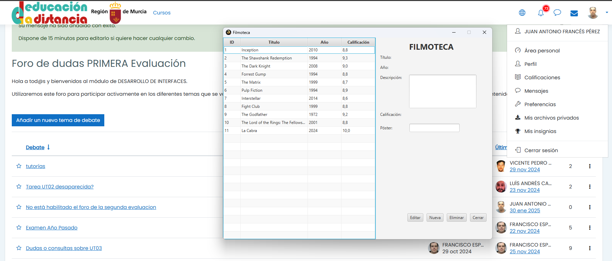
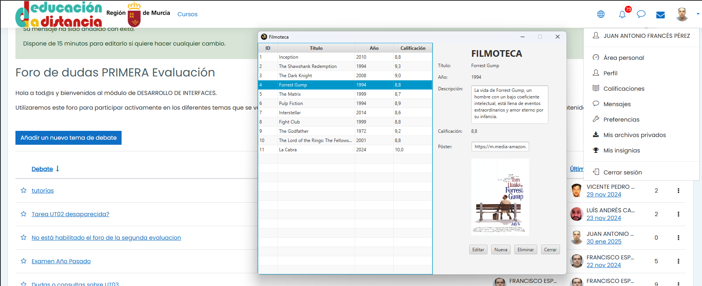

# Filmoteca

Filmoteca es una aplicación JavaFX para gestionar una colección de películas. Permite añadir, modificar, borrar y buscar películas, así como ver detalles de cada una.

## Información del Alumno

- **Nombre y Apellidos**: Juan Antonio Francés Pérez
- **NRA (Número regional de alumno)**: 3850437
- **Correo de Alumno**: 3850437@alu.murciaeduca.es
- **Página Personal**: [jualas.es](http://jualas.es)

## Capturas de Pantallas





## Requisitos

- Java 17 o superior
- Maven 3.6.0 o superior

## Configuración del Proyecto

1. Clona el repositorio:
   ```sh
   git clone https://github.com/jualas/Asignaturas_DAM_24-25/tree/main/Desarrollo_de_Interfaces/2_Evaluacion/filmoteca
   cd filmoteca